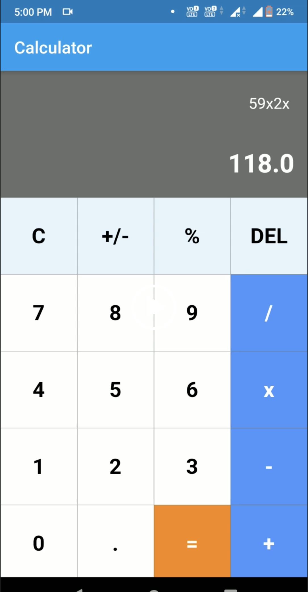
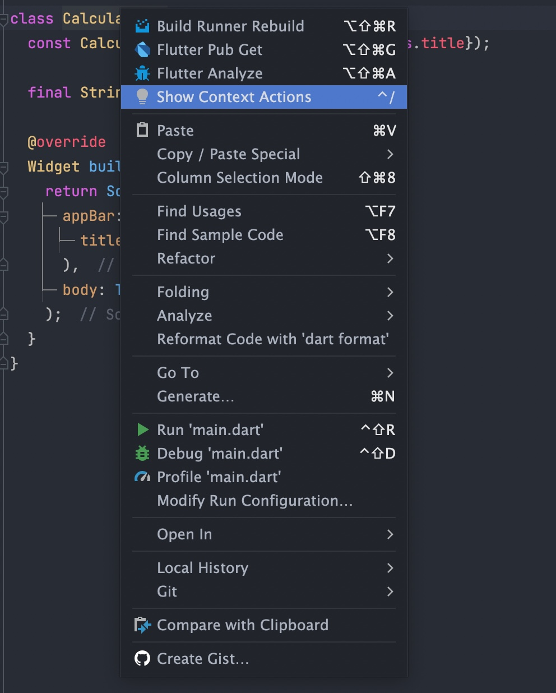

# Zuhlke learning path - Calculator App
- Download Android Studio and open this project
- Press `<no device selected>` in the Run config and open iOS or android emulator
- Press the green play button to run the app

## Requirements:
Create a calculator app with flutter mobile. The user should be able to press the buttons and perform simple calculations.

Try to match the demo example UI as closely as possible. Once you have completed this exercise, send it to kenneth.ng@zuhlke.com for a code review. 

## Tips:
- Start off by adding UI to `CalculatorUi`, you can ignore adding state to your app until later. Firstly, focus on hardcoding values and getting the hang of UI creation
- Give the app a title by changing the title property on line 18, and giving that a blue background
- Replace the `Text` widget saying 'Replace me' with a `Column` that contains the user input, and answer. Give this a grey background. Remember to right align the text
- The grey box with user input & answer should take 1/4 of the screen (excluding the title), while the buttons should take 3/4 of the screen height (excluding the title). Try using `Expanded` and `Flex` to achieve this.
- Learn how to use builder pattern widgets, i.e. use `GridView.builder` to create a layout with four columns. Create a variable to store the list of buttons, and pass this into the `GridView.builder`

- Next, change `CalculatorUi` into a `StatefulWidget` by right clicking on that text, and pressing context actions. Then select `Convert to Stateful Widget`
 

- Bind user inputs to each of the buttons, and finish this exercise

## Bonus exercise:
- Refactor the app by moving widgets into their own files, and import into `main.dart`
- Go into `analysis_options.yaml` and remove the `prefer_const_constructors: false` line. Then amend your code to use const constructors

_simple-calculator-app-using-flutter_
